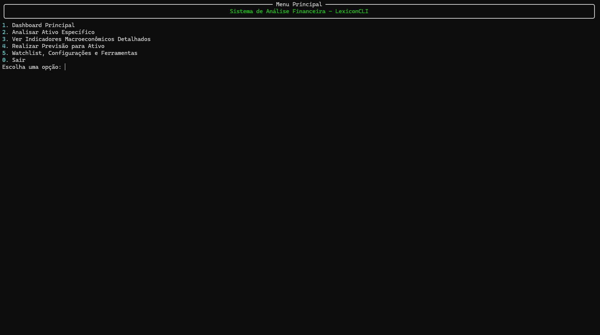
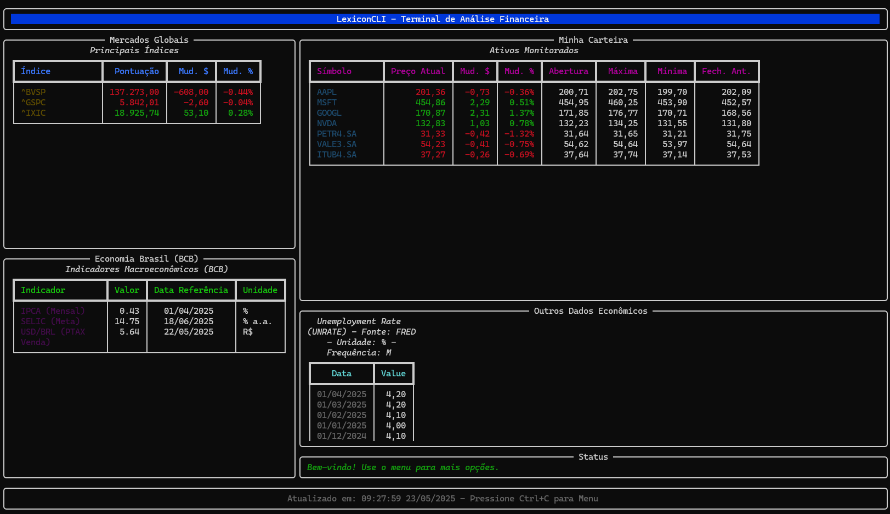
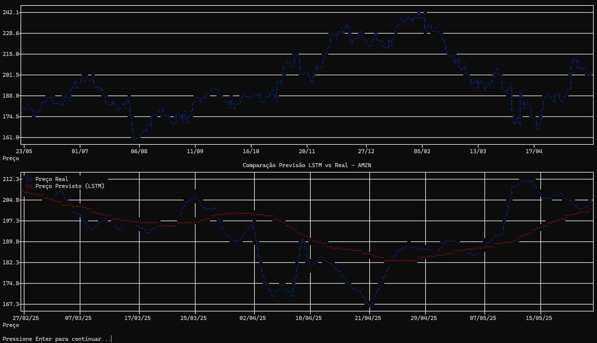

# LexiconCLI - Sistema de Análise Financeira

LexiconCLI é um sistema de análise financeira abrangente e interativo, meticulosamente desenvolvido em Python para operar diretamente no ambiente de terminal. Este projeto foi concebido para capacitar traders, investidores e entusiastas do mercado financeiro com ferramentas poderosas para monitoramento de mercados em tempo real, execução de análises técnicas aprofundadas e obtenção de previsões de séries temporais baseadas em modelos de Machine Learning consagrados, como LSTM e Prophet. A arquitetura do LexiconCLI foi cuidadosamente planejada e implementada seguindo o padrão Model-View-Controller (MVC), garantindo uma estrutura de código organizada, modular e de fácil manutenção, o que se reflete na clara separação de responsabilidades entre os componentes de modelo, visão e controle. O sistema se destaca pela sua capacidade de integrar e processar dados de uma vasta gama de APIs financeiras, pela robustez de seu mecanismo de cache, pela sofisticação de sua interface de usuário no terminal construída com a biblioteca Rich, e pela inclusão de um sistema de alertas configurável que opera em background para notificações proativas.

## 🎯 Funcionalidades

- ✅ **Monitoramento de mercado**: Dashboard interativo com ações e índices globais
- ✅ **Watchlist personalizada**: Acompanhamento de ativos favoritos do usuário
- ✅ **Indicadores macroeconômicos**: Visualização de dados econômicos chave
- ✅ **Análise técnica completa**: Ampla gama de indicadores técnicos
  - **Tendência**: SMA/EMA (9, 21, 50, 200 dias), MACD, Bandas de Bollinger, ADX
  - **Momentum**: RSI, Oscilador Estocástico
  - **Volume**: OBV (On-Balance Volume)
  - **Volatilidade**: ATR, Desvio Padrão dos Retornos
- ✅ **Modelos de previsão**: LSTM e Prophet para análise de séries temporais
- ✅ **Múltiplas fontes de dados**: Integração com APIs financeiras diversas
- ✅ **Sistema de cache inteligente**: Otimização de performance com SQLite
- ✅ **Alertas personalizáveis**: Notificações baseadas em preços e indicadores
- ✅ **Exportação de dados**: CSV, TXT e outros formatos
- ✅ **Interface rica no terminal**: Menus navegáveis e gráficos interativos

## 🔧 Tecnologias

- **Python 3.9+**: Linguagem de programação principal
- **Rich**: Interface de usuário avançada para terminal
- **Plotext**: Visualização de gráficos no terminal
- **SQLite**: Armazenamento local e cache de dados
- **Pandas & NumPy**: Manipulação e análise de dados
- **TensorFlow/Keras**: Modelos LSTM para previsão
- **Prophet (Meta)**: Análise de tendências e sazonalidades
- **scikit-learn**: Pré-processamento e métricas de ML
- **TA-Lib**: Biblioteca de análise técnica

### APIs Integradas

- **Finnhub**: Cotações em tempo real e busca de símbolos
- **yfinance**: Dados históricos de mercado
- **python-bcb**: Indicadores macroeconômicos brasileiros (IPCA, SELIC, PTAX)
- **Investpy**: Dados históricos com mapeamento para mercados globais
- **FRED**: Séries econômicas americanas
- **Nasdaq Data Link**: Datasets variados e commodities
- **Alpha Vantage**: Dados históricos complementares

## 📋 Pré-requisitos

- Python 3.9 ou superior
- Pip (gerenciador de pacotes)

## 🚀 Instalação

```bash
# Clonar o repositório
git clone https://github.com/thiagodifaria/LexiconCLI.git
cd LexiconCLI

# Criar ambiente virtual (recomendado)
python -m venv venv

# Ativar ambiente virtual
source venv/bin/activate  # Linux/Mac
venv\Scripts\activate     # Windows

# Instalar dependências
pip install -r requirements.txt
```

## ⚙️ Configuração

1. Crie um arquivo `.env` na raiz do projeto:
   ```bash
   touch .env  # Linux/Mac
   ```

2. Adicione suas chaves de API no arquivo `.env`:
   ```env
   # Chaves de API necessárias
   FINNHUB_API_KEY=sua_chave_finnhub_aqui
   ALPHA_VANTAGE_API_KEY=sua_chave_alphavantage_aqui
   FRED_API_KEY=sua_chave_fred_aqui
   NASDAQ_API_KEY=sua_chave_nasdaq_aqui
   
   # Configurações opcionais
   DEFAULT_PERIOD=1y
   CACHE_EXPIRATION=3600
   ```

**Nota**: As APIs yfinance, python-bcb e investpy não requerem chaves para uso básico.

## 🖥️ Executando a Aplicação

```bash
# Com ambiente virtual ativado
python main.py
```

**Windows**: O sistema tentará abrir em uma nova janela de console para melhor experiência visual.

## 📊 Como Usar

### Menu Principal
Após iniciar a aplicação, você verá um dashboard com visão geral do mercado. Navegue pelos menus usando as opções numéricas:

1. **Análise de Ativo**: Insira um símbolo para visualizar gráficos e indicadores técnicos
2. **Indicadores Macro**: Dados detalhados do BCB, FRED e Nasdaq Data Link
3. **Previsões**: Execute modelos LSTM ou Prophet com métricas e gráficos comparativos
4. **Watchlist & Configurações**: Gerencie favoritos, alertas e preferências

### Configuração de Alertas
```
Tipo de Alerta:
1. Preço acima de valor
2. RSI em sobrecompra (>70)
3. MACD cruzamento altista
```

## 🧪 Testes

```bash
# Executar todos os testes
pytest

# Executar com relatório de cobertura
pytest --cov=controllers --cov=models --cov=views --cov=utils tests/

# Testes específicos
pytest tests/test_models.py::test_lstm_prediction
```

## 📷 Screenshots

### Menu Principal


### Dashboard Principal


### Análise de Ativo - (AMZN)


### Previsão LSTM - (AMZN)


## 🔄 Fluxo de Desenvolvimento

1. Clone o repositório
2. Crie uma branch para sua feature (`git checkout -b feature/nome-da-feature`)
3. Implemente suas alterações seguindo o padrão MVC
4. Adicione testes correspondentes
5. Execute todos os testes (`pytest`)
6. Formate o código (seguindo PEP 8)
7. Faça commit das alterações (`git commit -m 'feat: adiciona nova funcionalidade'`)
8. Envie para a branch (`git push origin feature/nome-da-feature`)
9. Abra um Pull Request

## 📈 Modelos de Machine Learning

### LSTM (Long Short-Term Memory)
- Treinado com dados históricos e indicadores técnicos
- Predição de preços futuros
- Métricas: MAE, RMSE, taxa de acerto direcional

### Prophet (Meta)
- Análise de tendências e sazonalidades
- Detecção de padrões temporais
- Previsões com intervalos de confiança

### Avaliação de Modelos
```
Métricas LSTM - AAPL:
├─ MAE: 2.34
├─ RMSE: 3.12
└─ Acerto Direcional: 67.8%
```

## 🚢 Deploy

### Executável Standalone
```bash
# Criar executável com PyInstaller
pip install pyinstaller
pyinstaller --onefile --name LexiconCLI main.py
```

### Docker (Futuro)
```bash
# Construir imagem
docker build -t lexicon-cli .

# Executar container
docker run -it --rm lexicon-cli
```

## 🛣️ Roadmap

- [ ] **Interface Gráfica (GUI)**: Implementação com PySide6
- [ ] **Testes Expandidos**: Maior cobertura e testes de borda
- [ ] **Persistência de Modelos**: Salvar modelos treinados (LSTM/Prophet)
- [ ] **Análise Fundamentalista**: Balanços, DREs, fluxos de caixa
- [ ] **Alertas Avançados**: Notificações do sistema operacional
- [ ] **Backtesting**: Simulação de estratégias de trading

## 🎯 Recursos Avançados

### Cache Inteligente
- Armazenamento local com SQLite
- Tempo de expiração configurável
- Otimização automática de requisições

### Sistema de Alertas
- Monitoramento contínuo em thread separada
- Alertas baseados em:
  - Níveis de preço
  - Condições de indicadores (RSI, MACD)
  - Cruzamentos de médias móveis

### Exportação de Dados
- **CSV**: Dados históricos e tabelas de indicadores
- **TXT**: Watchlist e configurações
- **JSON**: Configurações completas do usuário

## 📜 Licença

Este projeto está licenciado sob a licença MIT - veja o arquivo [LICENSE](LICENSE) para detalhes.

## 📞 Contato

Thiago Di Faria - [thiagodifaria@gmail.com](mailto:thiagodifaria@gmail.com)

Link do projeto: [https://github.com/thiagodifaria/LexiconCLI](https://github.com/thiagodifaria/LexiconCLI)