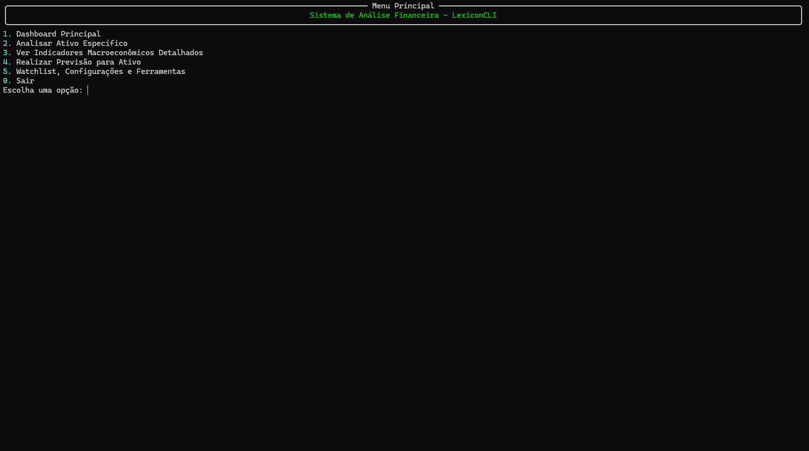
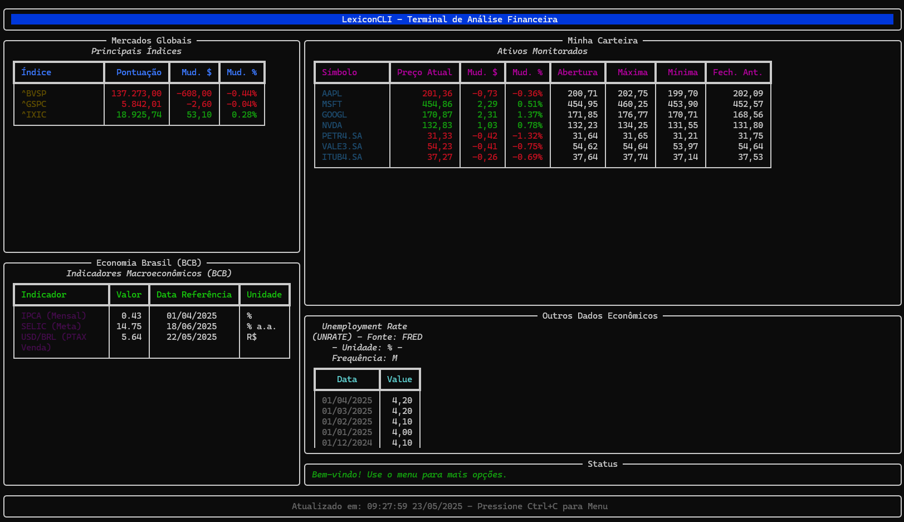

# LexiconCLI - Financial Analysis System

LexiconCLI is an interactive and cutting-edge financial analysis system, meticulously developed in Python to operate directly in the terminal environment. This project was conceived to empower traders, investors, quantitative analysts, and financial market enthusiasts with advanced tools for market monitoring, probabilistic forecasting, and uncertainty quantification. The LexiconCLI architecture implements state-of-the-art techniques in Financial Deep Learning, including models such as Bayesian LSTM, Prophet, as well as techniques like Monte Carlo Dropout and adaptive optimization systems. The structure rigorously follows the Model-View-Controller (MVC) pattern, ensuring modularity, scalability, enterprise maintainability, and clear separation of responsibilities. The system stands out for its ability to integrate and process data from a vast range of financial APIs, the robustness of its caching mechanism for performance optimization, the sophistication of its user interface built with the Rich library, and the inclusion of a configurable alert system that operates in the background for proactive notifications.

## 🚀 Executable Available

📦 **Direct Download**: Pre-compiled executable available in the [Releases](https://github.com/thiagodifaria/LexiconCLI/releases/download/v2.0.0/LexiconCLI.exe) section - No Python installation required!

## 🎯 Features

- ✅ **Market monitoring**: Interactive dashboard with global stocks and indices
- ✅ **Custom watchlist**: Tracking of user's favorite assets
- ✅ **Macroeconomic indicators**: Visualization of key economic data (BCB, FRED, Nasdaq)
- ✅ **Complete technical analysis**: Wide range of advanced technical indicators
  - **Trend**: SMA/EMA (9, 21, 50, 200 days), MACD, Bollinger Bands, ADX
  - **Momentum**: RSI, Stochastic Oscillator, ROC, Williams %R
  - **Volume**: OBV (On-Balance Volume), Volume SMA
  - **Volatility**: ATR, Standard Deviation of Returns, Rolling Volatility
- ✅ **Advanced prediction models**: Bayesian LSTM and Prophet with uncertainty quantification
- ✅ **Monte Carlo simulation**: Probabilistic analysis of future scenarios with GBM
- ✅ **Fundamental analysis**: Balance sheets, Income statements and cash flows via Finnhub
- ✅ **Intelligent backtesting**: Strategy testing with automatic parameter optimization
- ✅ **Real-time alert system**: Notifications based on prices, RSI, MACD and custom conditions
- ✅ **Data augmentation**: Advanced techniques (jittering, time/magnitude warping) for small datasets
- ✅ **Adaptive feature selection**: Automatic feature selection based on dataset
- ✅ **Ensemble learning**: Combination of multiple models for greater accuracy
- ✅ **Multiple data sources**: Integration with 7+ diverse financial APIs
- ✅ **Intelligent cache system**: Performance optimization with SQLite
- ✅ **Data export**: CSV, TXT and other formats
- ✅ **Rich terminal interface**: Navigable menus and interactive graphs with Rich

## 🔧 Technologies

### Core Technologies
- **Python 3.9+**: Main programming language
- **Rich**: Advanced terminal user interface with color and layout support
- **Plotext**: ASCII graph visualization in terminal
- **SQLite**: Local storage, cache and data persistence
- **Pandas & NumPy**: High-performance data manipulation and analysis

### Machine Learning & AI
- **TensorFlow/Keras**: Main framework for deep learning
- **Scikit-learn**: Preprocessing, metrics and model validation
- **Prophet (Meta)**: Trend analysis, seasonality and temporal decomposition
- **SciPy**: Scientific algorithms and numerical optimization
- **TA-Lib**: Specialized library for technical analysis

### Advanced Quantitative Analysis
- **Monte Carlo Dropout**: Bayesian uncertainty quantification
- **Focal Loss**: Specialized loss function for unbalanced classes
- **Bayesian Neural Networks**: Neural networks with uncertainty quantification
- **Adaptive Feature Selection**: Intelligent feature selection
- **Time Series Augmentation**: Data augmentation for time series
- **Backtesting Library**: Professional backtesting framework

### Integrated APIs

- **Finnhub**: Real-time quotes, symbol search and fundamental data
- **yfinance**: Historical market data and corporate information
- **python-bcb**: Brazilian macroeconomic indicators (IPCA, SELIC, PTAX)
- **Investpy**: Historical data with mapping to global markets
- **FRED (Federal Reserve)**: American economic series and macro indicators
- **Nasdaq Data Link**: Varied datasets, commodities and alternative data
- **Alpha Vantage**: Complementary historical data and sentiment analysis

## 📈 Machine Learning Models

### Advanced Bayesian LSTM
- **Architecture**: Bidirectional LSTM with Monte Carlo Dropout
- **Uncertainty Quantification**: Epistemic and aleatoric uncertainty
- **Features**: Technical indicators + temporal features + sentiment score
- **Optimization**: Focal Loss for unbalanced classes
- **Validation**: Cross-symbol validation and threshold optimization
- **Metrics**: Accuracy, F1-weighted, Balanced Accuracy, Cohen's Kappa

### Multivariate Prophet (Meta)
- **Capabilities**: Trend analysis, seasonality and holidays
- **Regressors**: Technical indicators as external variables
- **Confidence Intervals**: Predictions with uncertainty bands
- **Detection**: Automatic changepoints and anomalies
- **Validation**: Temporal backtesting with robust metrics

### Monte Carlo Simulator
- **Model**: Geometric Brownian Motion (GBM) 
- **Parameters**: Dynamically calculated drift and volatility
- **Simulations**: Up to 10,000 parallel trajectories
- **Statistics**: Percentiles, VaR, risk metrics
- **Visualization**: Interactive ASCII graphs

### Ensemble & Hybrid Methods
- **Ensemble LSTM + Monte Carlo**: Weighted voting between models
- **Uncertainty Aggregation**: Combination of epistemic uncertainties
- **Adaptive Weighting**: Dynamic weights based on performance
- **Calibration**: Uncertainty calibration for better reliability

### Model Evaluation
```
Bayesian LSTM Metrics - AAPL:
├─ Accuracy: 93.8%
├─ F1-Score (Weighted): 0.645
├─ Balanced Accuracy: 38.0%
├─ Mean Confidence: 0.742
├─ Epistemic Uncertainty: 0.156
└─ Threshold Optimization: Enabled
```

## 🎯 Advanced Features

### Intelligent Cache System
- **Backend**: SQLite with automatic compression
- **Strategies**: Differentiated TTL by data source
- **Optimization**: Cache-aside pattern with graceful fallback
- **Persistence**: Trained models and user configurations

### Proactive Alert System
- **Monitoring**: Dedicated thread for continuous verification
- **Alert Types**: 
  - Prices (above/below threshold)
  - Technical indicators (RSI overbought/oversold)
  - Moving average crossovers and MACD signals
  - Programmable custom conditions
- **Notifications**: Operating system + real-time console
- **Configuration**: Interactive interface for creation/editing

### Advanced Data Augmentation
- **Implemented Techniques**:
  - **Jittering**: Addition of calibrated Gaussian noise
  - **Time Warping**: Temporal distortion with cubic splines
  - **Magnitude Warping**: Non-linear amplitude scaling
- **Safety**: Timeout protection and quality validation
- **Adaptive**: Multipliers based on dataset size

### Intelligent Feature Selection
- **Methods**: Correlation filtering, variance thresholding, mutual information
- **Adaptive**: Automatic configuration based on dataset size
- **Validation**: Cross-validation for robust selection
- **Analysis**: Correlation matrix and redundancy groups

### Adaptive Architecture
- **Dynamic LSTM**: Architecture automatically adjusted to dataset
- **Complexity Management**: Control of samples/parameters ratio
- **Regularization**: Adaptive Dropout and L2
- **Early Stopping**: Intelligent stopping with multiple metrics

### Unbalanced Classes Treatment
- **Focal Loss**: Custom implementation with adaptive parameters
- **Class Weighting**: Balanced, balanced_smooth and inverse strategies
- **Threshold Optimization**: Grid search for F1-score optimization
- **Oversampling**: Specific data augmentation techniques

### Export and Reports
- **Formats**: Structured CSV, formatted TXT, JSON configurations
- **Content**: Historical data, calculated indicators, backtesting results
- **Automation**: Scheduled reports and batch export
- **Compression**: Automatic optimization for large files

## 📋 Prerequisites

- Python 3.9 or higher
- Pip (package manager)

## 🚀 Installation

```bash
# Clone the repository
git clone https://github.com/thiagodifaria/LexiconCLI.git
cd LexiconCLI

# Create virtual environment (recommended)
python -m venv venv

# Activate virtual environment
source venv/bin/activate  # Linux/Mac
venv\Scripts\activate     # Windows

# Install dependencies
pip install -r requirements.txt
```

## ⚙️ Configuration

1. Create a `.env` file in the project root:
   ```bash
   touch .env  # Linux/Mac
   ```

2. Add your API keys to the `.env` file:
   ```env
   # Required API keys
   FINNHUB_API_KEY=your_finnhub_key_here
   ALPHA_VANTAGE_API_KEY=your_alphavantage_key_here
   FRED_API_KEY=your_fred_key_here
   NASDAQ_API_KEY=your_nasdaq_key_here
   
   # Optional configurations
   DEFAULT_PERIOD=1y
   CACHE_EXPIRATION=3600
   ```

**Note**: The yfinance, python-bcb and investpy APIs do not require keys for basic usage.

## 🖥️ Running the Application

```bash
# With virtual environment activated
python main.py
```

**Windows**: The system will try to open in a new console window for better visual experience.

## 📊 How to Use

### Main Menu
After starting the application, you will see a dashboard with market overview. Navigate through the menus using the numeric options:

1. **Asset Analysis**: Enter a symbol to view charts and technical indicators
2. **Macro Indicators**: Detailed data from BCB, FRED and Nasdaq Data Link
3. **Predictions**: Run Bayesian LSTM or Prophet models with metrics and comparative charts
4. **Watchlist & Settings**: Manage favorites, alerts and preferences

### Alert Configuration
```
Alert Type:
1. Price above value
2. RSI in overbought (>70)
3. MACD bullish crossover
4. Custom conditions
```

## 🧪 Tests

```bash
# Run all tests
pytest

# Run with coverage report
pytest --cov=controllers --cov=models --cov=views --cov=utils tests/

# Specific tests
pytest tests/test_models.py::test_lstm_prediction
```

## 📷 Screenshots

### Main Menu


### Main Dashboard


### Asset Analysis - (AMZN)


### LSTM Prediction - (AMZN)


## 🔄 Development Flow

1. Clone the repository
2. Create a branch for your feature (`git checkout -b feature/feature-name`)
3. Implement your changes following the MVC pattern
4. Add corresponding tests
5. Run all tests (`pytest`)
6. Format the code (following PEP 8)
7. Commit the changes (`git commit -m 'feat: add new functionality'`)
8. Push to the branch (`git push origin feature/feature-name`)
9. Open a Pull Request

## 🚢 Deploy

### Standalone Executable
```bash
# Create executable with PyInstaller
pip install pyinstaller
pyinstaller --onefile --name LexiconCLI main.py
```

### Docker (Future)
```bash
# Build image
docker build -t lexicon-cli .

# Run container
docker run -it --rm lexicon-cli
```

## 📜 License

This project is licensed under the MIT License - see the [LICENSE](LICENSE) file for details.

## 📞 Contact

Thiago Di Faria - [thiagodifaria@gmail.com](mailto:thiagodifaria@gmail.com)

Project link: [https://github.com/thiagodifaria/LexiconCLI](https://github.com/thiagodifaria/LexiconCLI)