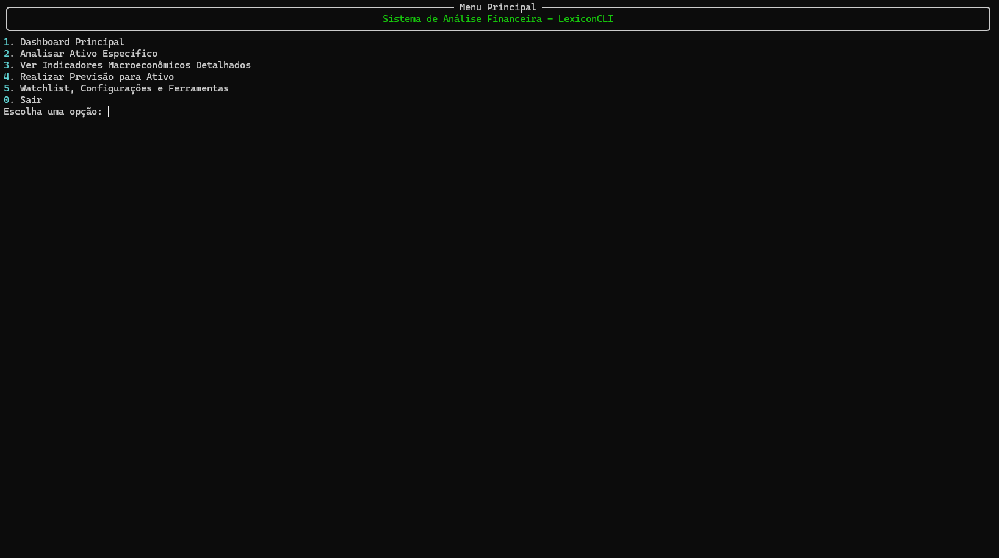
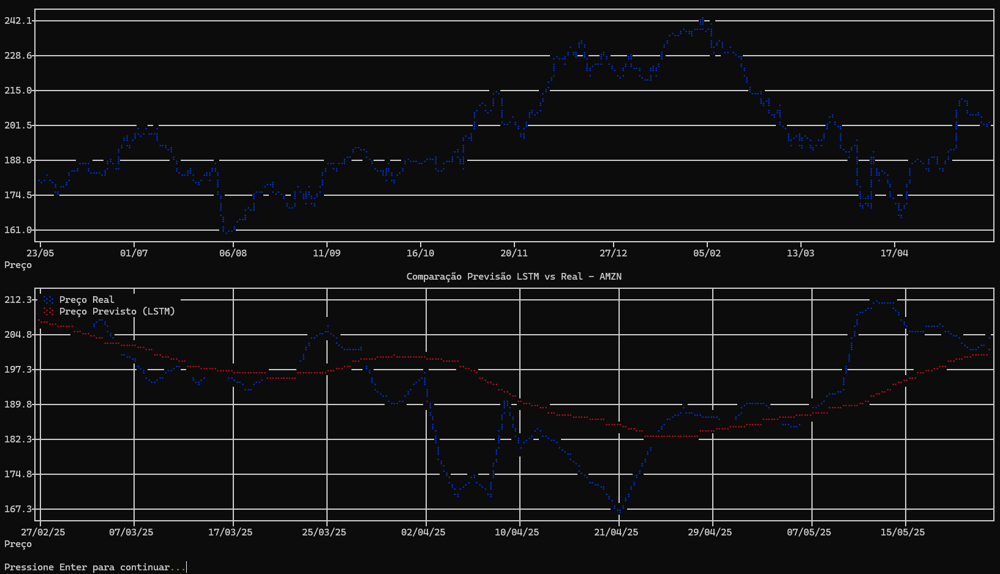

# LexiconCLI - Sistema de Análise Financeira

LexiconCLI é um sistema de análise financeira interativo e de última geração, meticulosamente desenvolvido em Python para operar diretamente no ambiente de terminal. Este projeto foi concebido para capacitar traders, investidores, analistas quantitativos e entusiastas do mercado financeiro com ferramentas avançadas para monitoramento de mercados, previsões probabilísticas e quantificação de incerteza. A arquitetura do LexiconCLI implementa técnicas state-of-the-art em Deep Learning Financeiro, incluindo modelos como Bayesian LSTM, Prophet, além de técnicas como Monte Carlo Dropout e sistemas adaptativos de otimização. A estrutura segue rigorosamente o padrão Model-View-Controller (MVC), garantindo modularidade, escalabilidade, manutenibilidade empresarial e uma clara separação de responsabilidades. O sistema se destaca pela sua capacidade de integrar e processar dados de uma vasta gama de APIs financeiras, pela robustez de seu mecanismo de cache para otimização de performance, pela sofisticação de sua interface de usuário construída com a biblioteca Rich e pela inclusão de um sistema de alertas configurável que opera em background para notificações proativas.

## 🚀 Executável Disponível

📦 **Download Direto**: Executável pré-compilado disponível na seção [Releases](https://github.com/thiagodifaria/LexiconCLI/releases/download/v2.0.0/LexiconCLI.exe) - Sem necessidade de instalação do Python!

## 🎯 Funcionalidades

- ✅ **Monitoramento de mercado**: Dashboard interativo com ações e índices globais
- ✅ **Watchlist personalizada**: Acompanhamento de ativos favoritos do usuário
- ✅ **Indicadores macroeconômicos**: Visualização de dados econômicos chave (BCB, FRED, Nasdaq)
- ✅ **Análise técnica completa**: Ampla gama de indicadores técnicos avançados
  - **Tendência**: SMA/EMA (9, 21, 50, 200 dias), MACD, Bandas de Bollinger, ADX
  - **Momentum**: RSI, Oscilador Estocástico, ROC, Williams %R
  - **Volume**: OBV (On-Balance Volume), Volume SMA
  - **Volatilidade**: ATR, Desvio Padrão dos Retornos, Volatilidade Rolling
- ✅ **Modelos de previsão avançados**: LSTM Bayesian e Prophet com quantificação de incerteza
- ✅ **Simulação Monte Carlo**: Análise probabilística de cenários futuros com GBM
- ✅ **Análise fundamentalista**: Balanços patrimoniais, DRE e fluxos de caixa via Finnhub
- ✅ **Backtesting inteligente**: Teste de estratégias com otimização automática de parâmetros
- ✅ **Sistema de alertas em tempo real**: Notificações baseadas em preços, RSI, MACD e condições personalizadas
- ✅ **Data augmentation**: Técnicas avançadas (jittering, time/magnitude warping) para datasets pequenos
- ✅ **Feature selection adaptativo**: Seleção automática de features baseada no dataset
- ✅ **Ensemble learning**: Combinação de múltiplos modelos para maior precisão
- ✅ **Múltiplas fontes de dados**: Integração com 7+ APIs financeiras diversas
- ✅ **Sistema de cache inteligente**: Otimização de performance com SQLite
- ✅ **Exportação de dados**: CSV, TXT e outros formatos
- ✅ **Interface rica no terminal**: Menus navegáveis e gráficos interativos com Rich

## 🔧 Tecnologias

### Core Technologies
- **Python 3.9+**: Linguagem de programação principal
- **Rich**: Interface de usuário avançada para terminal com suporte a cores e layouts
- **Plotext**: Visualização de gráficos ASCII no terminal
- **SQLite**: Armazenamento local, cache e persistência de dados
- **Pandas & NumPy**: Manipulação e análise de dados de alta performance

### Machine Learning & AI
- **TensorFlow/Keras**: Framework principal para deep learning
- **Scikit-learn**: Pré-processamento, métricas e validação de modelos
- **Prophet (Meta)**: Análise de tendências, sazonalidades e decomposição temporal
- **SciPy**: Algoritmos científicos e otimização numérica
- **TA-Lib**: Biblioteca especializada em análise técnica

### Análise Quantitativa Avançada
- **Monte Carlo Dropout**: Quantificação de incerteza bayesiana
- **Focal Loss**: Função de perda especializada para classes desbalanceadas
- **Bayesian Neural Networks**: Redes neurais com quantificação de incerteza
- **Adaptive Feature Selection**: Seleção inteligente de features
- **Time Series Augmentation**: Aumento de dados para séries temporais
- **Backtesting Library**: Framework de backtesting profissional

### APIs Integradas

- **Finnhub**: Cotações em tempo real, busca de símbolos e dados fundamentalistas
- **yfinance**: Dados históricos de mercado e informações corporativas
- **python-bcb**: Indicadores macroeconômicos brasileiros (IPCA, SELIC, PTAX)
- **Investpy**: Dados históricos com mapeamento para mercados globais
- **FRED (Federal Reserve)**: Séries econômicas americanas e indicadores macro
- **Nasdaq Data Link**: Datasets variados, commodities e dados alternativos
- **Alpha Vantage**: Dados históricos complementares e análise de sentimento

## 📈 Modelos de Machine Learning

### LSTM Bayesian Avançado
- **Arquitetura**: Bidirectional LSTM com Monte Carlo Dropout
- **Quantificação de Incerteza**: Epistemic e aleatoric uncertainty
- **Features**: Indicadores técnicos + features temporais + sentiment score
- **Otimização**: Focal Loss para classes desbalanceadas
- **Validação**: Cross-symbol validation e threshold optimization
- **Métricas**: Accuracy, F1-weighted, Balanced Accuracy, Cohen's Kappa

### Prophet (Meta) Multivariado
- **Capacidades**: Análise de tendências, sazonalidades e feriados
- **Regressores**: Indicadores técnicos como variáveis externas
- **Intervalos de Confiança**: Previsões com bandas de incerteza
- **Detecção**: Changepoints automáticos e anomalias
- **Validação**: Backtesting temporal com métricas robustas

### Monte Carlo Simulator
- **Modelo**: Geometric Brownian Motion (GBM) 
- **Parâmetros**: Drift e volatilidade calculados dinamicamente
- **Simulações**: Até 10.000 trajetórias paralelas
- **Estatísticas**: Percentis, VaR, métricas de risco
- **Visualização**: Gráficos ASCII interativos

### Ensemble & Hybrid Methods
- **Ensemble LSTM + Monte Carlo**: Voting ponderado entre modelos
- **Uncertainty Aggregation**: Combinação de incertezas epistêmicas
- **Adaptive Weighting**: Pesos dinâmicos baseados em performance
- **Calibration**: Calibração de incerteza para melhor confiabilidade

### Avaliação de Modelos
```
Métricas LSTM Bayesian - AAPL:
├─ Accuracy: 93.8%
├─ F1-Score (Weighted): 0.645
├─ Balanced Accuracy: 38.0%
├─ Mean Confidence: 0.742
├─ Epistemic Uncertainty: 0.156
└─ Threshold Optimization: Enabled
```

## 🎯 Recursos Avançados

### Sistema de Cache Inteligente
- **Backend**: SQLite com compressão automática
- **Estratégias**: TTL diferenciado por fonte de dados
- **Otimização**: Cache-aside pattern com fallback graceful
- **Persistência**: Modelos treinados e configurações de usuário

### Sistema de Alertas Proativo
- **Monitoramento**: Thread dedicada para verificação contínua
- **Tipos de Alerta**: 
  - Preços (acima/abaixo de threshold)
  - Indicadores técnicos (RSI sobrecompra/sobrevenda)
  - Cruzamentos de médias móveis e sinais MACD
  - Condições customizadas programáveis
- **Notificações**: Sistema operacional + console em tempo real
- **Configuração**: Interface interativa para criação/edição

### Data Augmentation Avançado
- **Técnicas Implementadas**:
  - **Jittering**: Adição de ruído gaussiano calibrado
  - **Time Warping**: Distorção temporal com cubic splines
  - **Magnitude Warping**: Scaling não-linear de amplitudes
- **Segurança**: Timeout protection e validação de qualidade
- **Adaptativo**: Multiplicadores baseados no tamanho do dataset

### Feature Selection Inteligente
- **Métodos**: Correlation filtering, variance thresholding, mutual information
- **Adaptativo**: Configuração automática baseada no tamanho do dataset
- **Validação**: Cross-validation para seleção robusta
- **Análise**: Matriz de correlação e grupos de redundância

### Arquitetura Adaptativa
- **Dynamic LSTM**: Arquitetura ajustada automaticamente ao dataset
- **Complexity Management**: Controle da relação samples/parameters
- **Regularization**: Dropout e L2 adaptativos
- **Early Stopping**: Parada inteligente com múltiplas métricas

### Tratamento de Classes Desbalanceadas
- **Focal Loss**: Implementação customizada com parâmetros adaptativos
- **Class Weighting**: Estratégias balanced, balanced_smooth e inverse
- **Threshold Optimization**: Busca grid para otimização de F1-score
- **Oversampling**: Técnicas de data augmentation específicas

### Exportação e Relatórios
- **Formatos**: CSV estruturado, TXT formatado, JSON configurações
- **Conteúdo**: Dados históricos, indicadores calculados, resultados de backtesting
- **Automação**: Relatórios schedulados e exportação em batch
- **Compressão**: Otimização automática para arquivos grandes

## 📋 Pré-requisitos

- Python 3.9 ou superior
- Pip (gerenciador de pacotes)

## 🚀 Instalação

```bash
# Clonar o repositório
git clone https://github.com/thiagodifaria/LexiconCLI.git
cd LexiconCLI

# Criar ambiente virtual (recomendado)
python -m venv venv

# Ativar ambiente virtual
source venv/bin/activate  # Linux/Mac
venv\Scripts\activate     # Windows

# Instalar dependências
pip install -r requirements.txt
```

## ⚙️ Configuração

1. Crie um arquivo `.env` na raiz do projeto:
   ```bash
   touch .env  # Linux/Mac
   ```

2. Adicione suas chaves de API no arquivo `.env`:
   ```env
   # Chaves de API necessárias
   FINNHUB_API_KEY=sua_chave_finnhub_aqui
   ALPHA_VANTAGE_API_KEY=sua_chave_alphavantage_aqui
   FRED_API_KEY=sua_chave_fred_aqui
   NASDAQ_API_KEY=sua_chave_nasdaq_aqui
   
   # Configurações opcionais
   DEFAULT_PERIOD=1y
   CACHE_EXPIRATION=3600
   ```

**Nota**: As APIs yfinance, python-bcb e investpy não requerem chaves para uso básico.

## 🖥️ Executando a Aplicação

```bash
# Com ambiente virtual ativado
python main.py
```

**Windows**: O sistema tentará abrir em uma nova janela de console para melhor experiência visual.

## 📊 Como Usar

### Menu Principal
Após iniciar a aplicação, você verá um dashboard com visão geral do mercado. Navegue pelos menus usando as opções numéricas:

1. **Análise de Ativo**: Insira um símbolo para visualizar gráficos e indicadores técnicos
2. **Indicadores Macro**: Dados detalhados do BCB, FRED e Nasdaq Data Link
3. **Previsões**: Execute modelos LSTM Bayesian ou Prophet com métricas e gráficos comparativos
4. **Watchlist & Configurações**: Gerencie favoritos, alertas e preferências

### Configuração de Alertas
```
Tipo de Alerta:
1. Preço acima de valor
2. RSI em sobrecompra (>70)
3. MACD cruzamento altista
4. Condições personalizadas
```

## 🧪 Testes

```bash
# Executar todos os testes
pytest

# Executar com relatório de cobertura
pytest --cov=controllers --cov=models --cov=views --cov=utils tests/

# Testes específicos
pytest tests/test_models.py::test_lstm_prediction
```

## 📷 Screenshots

### Menu Principal


### Dashboard Principal


### Análise de Ativo - (AMZN)


### Previsão LSTM - (AMZN)


## 🔄 Fluxo de Desenvolvimento

1. Clone o repositório
2. Crie uma branch para sua feature (`git checkout -b feature/nome-da-feature`)
3. Implemente suas alterações seguindo o padrão MVC
4. Adicione testes correspondentes
5. Execute todos os testes (`pytest`)
6. Formate o código (seguindo PEP 8)
7. Faça commit das alterações (`git commit -m 'feat: adiciona nova funcionalidade'`)
8. Envie para a branch (`git push origin feature/nome-da-feature`)
9. Abra um Pull Request

## 🚢 Deploy

### Executável Standalone
```bash
# Criar executável com PyInstaller
pip install pyinstaller
pyinstaller --onefile --name LexiconCLI main.py
```

### Docker (Futuro)
```bash
# Construir imagem
docker build -t lexicon-cli .

# Executar container
docker run -it --rm lexicon-cli
```

## 📜 Licença

Este projeto está licenciado sob a licença MIT - veja o arquivo [LICENSE](LICENSE) para detalhes.

## 📞 Contato

Thiago Di Faria - [thiagodifaria@gmail.com](mailto:thiagodifaria@gmail.com)

Link do projeto: [https://github.com/thiagodifaria/LexiconCLI](https://github.com/thiagodifaria/LexiconCLI)